# AI DevOps Automation Pipeline — PRD

**Project:** Autonomous Multi-Agent Development Pipeline  
**Owner:** Woodson / Nessei Inc.  
**Status:** Phase 1 — Local Validation  
**Last Updated:** February 2026

---

## Overview

Build a fully autonomous AI-driven development pipeline where agents handle the full software development lifecycle — from planning to execution to PR submission — with minimal human involvement. The human role is reduced to initial planning approval and escalation resolution.

The system is built incrementally across three phases:

- **Phase 1 (Now):** Local validation with BeadHub + Docker Compose
- **Phase 2:** Production deployment on k3s (Raspberry Pi 5) + Daytona compute + GitHub integration
- **Phase 3:** Full automation with Discord notifications, multi-repo support, and Cloudflare tunnel access

---

## Goals

- Offload implementation work to agents while retaining architectural control
- Enable "work from anywhere" — plan from a phone, come back to PRs
- Minimize human-in-the-loop to: initial plan approval + escalation resolution
- Build on open, self-hostable infrastructure (no vendor lock-in beyond Claude API)
- Start simple, validate locally, expand incrementally

---

## Non-Goals (Phase 1)

- iOS/Android device testing (deferred to Phase 3)
- Multi-repo coordination
- Production Kubernetes deployment
- Discord notifications
- Daytona cloud compute

---

## Phase 1 — Local Validation

### Objective

Prove the core coordination loop works: orchestrator plans, workers execute, agents coordinate without human relay, escalations surface cleanly.

### Success Criteria

- BeadHub running locally via Docker Compose
- Two Claude Code instances (orchestrator + worker) coordinating via `bdh`
- Orchestrator breaks a feature spec into Beads tickets
- Worker claims a ticket, implements it, submits a PR
- Agents resolve blockers between themselves via BeadHub chat
- Human only intervenes for plan approval and escalations
- BeadHub dashboard accessible in browser showing live agent activity

### Stack

| Component           | Tool                       | Notes                               |
| ------------------- | -------------------------- | ----------------------------------- |
| Coordination server | BeadHub (self-hosted)      | Docker Compose locally              |
| Issue tracking      | Beads (`bd`/`bdh` CLI)     | Git-native, embedded in BeadHub     |
| Agent runtime       | Claude Code (local)        | Two instances in separate worktrees |
| Human interface     | Claude Desktop + `bdh` CLI | Orchestrator lives here             |
| Dashboard           | BeadHub UI                 | `http://localhost:8000`             |

### Docker Compose Services

```
beadhub     → Python API + frontend  (port 8000)
postgres    → persistent state       (claims, issues, policies)
redis       → ephemeral state        (presence, messages, file locks)
```

---

## Phase 2 — Production Infrastructure

### Objective

Move BeadHub to production k3s cluster. Add Daytona for isolated compute sandboxes. Connect GitHub for PR workflows.

### Additional Stack

| Component           | Tool                         | Notes                                           |
| ------------------- | ---------------------------- | ----------------------------------------------- |
| Orchestration infra | k3s on Raspberry Pi 5 (NVMe) | BeadHub + Postgres + Redis                      |
| Tunnel / ingress    | Cloudflare Tunnel + Access   | Zero-trust, no port forwarding                  |
| Compute sandboxes   | Daytona                      | Sub-90ms sandbox creation, pay-per-second       |
| Sandbox control     | Daytona MCP Server           | Orchestrator spawns/controls sandboxes as tools |
| Source control      | GitHub                       | PR submission, code review                      |
| Iteration loop      | Ralph Loop (Claude Code)     | Persistent agent iteration until completion     |

---

## Phase 3 — Full Automation

### Objective

Full autonomous pipeline. Agents run 24/7. Human interacts only via escalation and final PR review.

### Additional Stack

| Component           | Tool                        | Notes                                                       |
| ------------------- | --------------------------- | ----------------------------------------------------------- |
| Notifications       | Discord MCP                 | Escalation pings, PR ready alerts                           |
| Mobile testing      | Maestro + macOS runner      | Android via Daytona Linux, iOS via Mac mini / Daytona alpha |
| Multi-model routing | PAL MCP                     | Route review tasks to Gemini, logic to o3                   |
| Mobile access       | BeadHub dashboard (browser) | Monitor from phone via Cloudflare tunnel                    |

---

## Full Architecture

### Component Diagram

```mermaid
graph TB
    subgraph Human["👤 Human Interface"]
        CD[Claude Desktop<br/>Orchestrator Agent]
        PH[Phone Browser<br/>BeadHub Dashboard]
    end

    subgraph Coordination["🗂 Coordination Layer (Pi 5 / k3s)"]
        BH[BeadHub Server<br/>:8000]
        PG[(PostgreSQL<br/>claims · issues · policies)]
        RD[(Redis<br/>presence · locks · messages)]
        BH --> PG
        BH --> RD
    end

    subgraph Access["🌐 Access Layer"]
        CF[Cloudflare Tunnel<br/>beadhub.domain.com]
        CFA[Cloudflare Access<br/>Zero-Trust Auth]
        CF --> CFA --> BH
    end

    subgraph Compute["⚡ Compute Layer (Daytona)"]
        DS1[Sandbox: Worker 1<br/>Claude Code + bdh]
        DS2[Sandbox: Worker 2<br/>Claude Code + bdh]
        RL1[Ralph Loop]
        RL2[Ralph Loop]
        DS1 --> RL1
        DS2 --> RL2
    end

    subgraph Integration["🔗 Integrations"]
        GH[GitHub<br/>PRs · Reviews]
        DC[Discord<br/>Notifications]
        DY[Daytona MCP<br/>Sandbox Control]
    end

    CD -->|bdh CLI| BH
    CD -->|Daytona MCP| DY
    DY -->|spawn/control| DS1
    DY -->|spawn/control| DS2
    DS1 -->|bdh CLI| CF
    DS2 -->|bdh CLI| CF
    DS1 -->|git push| GH
    DS2 -->|git push| GH
    GH -->|PR ready| DC
    BH -->|escalation| DC
    DC -->|ping| PH
    PH -->|monitor| CF
```



### Phase 1 Flow (Local)

```mermaid
sequenceDiagram
    participant H as 👤 Human
    participant CD as Claude Desktop<br/>(Orchestrator)
    participant BH as BeadHub
    participant W1 as Worker Agent<br/>(Claude Code)

    H->>CD: "Build Schedule Drawer feature"
    CD->>BH: bdh create tickets (bd-01, bd-02, bd-03)
    CD->>H: Present plan + ticket tree
    H->>CD: Approve plan ✅

    CD->>W1: "Start work, check bdh"
    W1->>BH: bdh update bd-01 --status in_progress
    BH->>W1: Ticket claimed ✅

    loop Ralph Loop
        W1->>W1: implement → build → validate
        W1->>BH: bdh :aweb locks (reserve files)
    end

    W1->>BH: bdh close bd-01
    W1->>CD: bdh :aweb mail "bd-01 complete, PR ready"

    alt Blocked
        W1->>CD: bdh :aweb chat send-and-wait orchestrator "need decision on X"
        CD->>W1: response (no human needed)
    end

    alt Truly Stuck
        W1->>BH: bdh :escalate "need human" "context..."
        BH->>H: Dashboard escalation alert
        H->>BH: Respond with decision
        BH->>W1: Unblocked ✅
    end
```



### Phase 2 Flow (Daytona + GitHub)

```mermaid
sequenceDiagram
    participant H as 👤 Human
    participant CD as Claude Desktop
    participant DY as Daytona MCP
    participant SB as Daytona Sandbox
    participant BH as BeadHub (k3s)
    participant GH as GitHub

    H->>CD: Approve plan
    CD->>DY: create_sandbox(snapshot="sitelink-worker")
    DY->>SB: Boot sandbox (< 90ms)
    SB->>BH: bdh :init --beadhub-url https://beadhub.domain.com
    SB->>BH: bdh update bd-01 --status in_progress

    loop Ralph Loop (max 30 iterations)
        SB->>SB: code → build → test → screenshot
        SB->>SB: validate completion condition
    end

    SB->>GH: git push → open PR
    SB->>BH: bdh close bd-01
    CD->>DY: stop_sandbox (billing stops)
    GH->>H: PR notification
```



---

## Agent Roles

| Role                   | Runtime                        | Responsibilities                                                    |
| ---------------------- | ------------------------------ | ------------------------------------------------------------------- |
| **Orchestrator**       | Claude Desktop (local)         | Planning, ticket creation, task assignment, plan approval gating    |
| **Worker**             | Claude Code in Daytona sandbox | Implementation, testing, PR submission, agent-to-agent coordination |
| **Reviewer** (Phase 3) | Daytona sandbox                | PR review, test validation, feedback tickets                        |

---

## Human-in-the-Loop Touchpoints

| Touchpoint    | Trigger                           | Channel               | Expected Frequency |
| ------------- | --------------------------------- | --------------------- | ------------------ |
| Plan approval | Orchestrator presents ticket tree | Claude Desktop        | Every feature      |
| Escalation    | Agent genuinely blocked           | BeadHub dashboard     | Rare               |
| PR review     | Worker submits PR                 | GitHub / Discord ping | Every feature      |
| Budget check  | Daytona spend alert               | Email / Discord       | Weekly             |

---

## Implementation Sequence

### Phase 1 Checklist

- [ ] Clone BeadHub repo locally
- [ ] Run `make start` — validate Docker Compose stack
- [ ] Install `bd` (Beads CLI) and `bdh` (BeadHub CLI)
- [ ] `bdh :init` — register orchestrator workspace
- [ ] `bdh :add-worktree worker` — create worker workspace
- [ ] Start Claude Code in each worktree
- [ ] Run a test task end-to-end (simple SiteLink ticket)
- [ ] Validate: dashboard shows live agent activity
- [ ] Validate: agents coordinate without human relay
- [ ] Validate: escalation surfaces in dashboard

### Phase 2 Checklist

- [ ] Deploy BeadHub on k3s (Pi 5)
- [ ] Configure Cloudflare Tunnel + Access
- [ ] Validate `bdh` from Mac reaches Pi over tunnel
- [ ] Apply for Daytona startup credits ($50k)
- [ ] Build Daytona snapshot (Docker image with Claude Code + bdh pre-installed)
- [ ] Wire Daytona MCP into Claude Desktop
- [ ] Test end-to-end: Claude Desktop → Daytona → BeadHub → GitHub PR

### Phase 3 Checklist

- [ ] Discord MCP integration (escalation + PR pings)
- [ ] PAL MCP for multi-model routing
- [ ] iOS: submit Daytona macOS alpha request
- [ ] Android: Maestro in Daytona Linux sandbox
- [ ] BeadHub mobile dashboard validation

---

## Cost Model (Phase 2+)

| Item                      | Cost                   | Notes                                        |
| ------------------------- | ---------------------- | -------------------------------------------- |
| Pi 5 (8GB) + NVMe         | One-time ~$120         | Already owned                                |
| Cloudflare Tunnel         | Free                   | Zero egress cost                             |
| Daytona compute           | ~$0.067/hr running     | Pay-per-second, stops when idle              |
| Typical task              | ~$0.50–$3              | 10–30 Ralph iterations                       |
| Claude API                | ~$10/hr active compute | Covered by Daytona startup credits initially |
| MacinCloud (iOS, Phase 3) | ~$35–50/mo             | Only when iOS testing needed                 |

---

## Key Risks

| Risk                                   | Mitigation                                                                               |
| -------------------------------------- | ---------------------------------------------------------------------------------------- |
| Idle agents can't receive chat         | Claude Code PostToolUse hook handles this; workers are always in Ralph loop while active |
| Daytona sandbox can't reach Pi BeadHub | Cloudflare tunnel makes BeadHub publicly accessible                                      |
| Cost runaway                           | Ralph `--max-iterations 30` hard cap; Daytona sandbox auto-stop on completion            |
| BeadHub data loss                      | Postgres on NVMe with k8s PVC; daily backup to R2 (Phase 2)                              |

---

## References

- BeadHub: https://github.com/beadhub/beadhub
- Beads: https://github.com/steveyegge/beads
- Ralph Loop: https://github.com/frankbria/ralph-claude-code
- Daytona Docs: https://www.daytona.io/docs/
- PAL MCP: https://github.com/BeehiveInnovations/pal-mcp-server
- Maestro: https://maestro.dev
